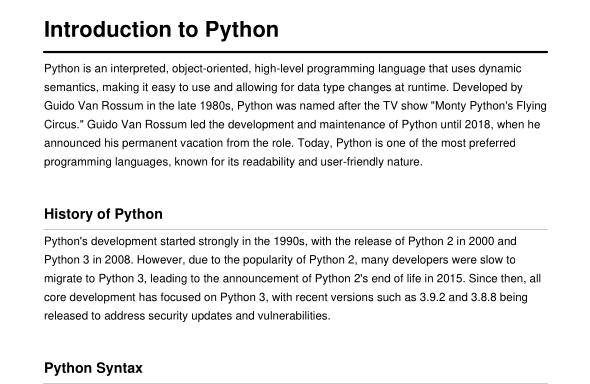

# VidNote

VidNote converts lecture and study videos into structured notes — automatically.

Upload a video and get:
- 📄 Full transcript
- 📝 Structured Markdown notes
- 📥 Downloadable PDF


> Best results with educational content — lectures, tutorials, exam prep, and concept explanations.


## 🌟 Features

- Upload any video file and auto-generate structured notes
- Audio extraction from video using FFmpeg
- Accurate speech-to-text transcription powered by OpenAI Whisper
- Live Markdown preview before downloading
- AI-powered note structuring from raw transcript
- One-click PDF export with styled formatting

## 📄 Example Output

### Input Video
[▶ Watch on YouTube](https://www.youtube.com/watch?v=JdG1cVFyj5A)

### Generated Notes
[](assets/example-output.pdf)

[📄 Preview PDF](assets/example-output.pdf)
## 🛠️ Tech Stack


## ⚙️ System Requirements

### Minimum (Development / Testing)

| Component | Requirement |
|-----------|------------|
| **OS** | Linux, macOS, or Windows (WSL2 recommended) |
| **CPU** | 4 cores |
| **RAM** | 8 GB (16 GB recommended) |
| **Disk** | 5+ GB free space |
| **Python** | 3.12+ |
| **Node.js** | 18+ (20+ recommended) |
| **FFmpeg** | Required for audio extraction |
| **Internet** | Required for Groq API calls |

### Recommended (Larger Videos / Smooth Usage)

| Component | Requirement |
|-----------|------------|
| **CPU** | 6+ cores |
| **RAM** | 16–32 GB |
| **Disk** | SSD with 10+ GB free |
| **GPU** | Optional — automatically used if CUDA is available, otherwise falls back to CPU |

### AI Model (Groq + Llama)

> This project uses Groq-hosted Llama models via the `GROQ_MODEL` env variable.
> Example: `llama-3.3-70b-versatile`

- ✅ No need to run Llama locally
- 🔑 A valid `GROQ_API_KEY` is required
- 🌐 Stable internet connection is required

## 📁 Project Structure
```text
vidNote/
├── backend/
│   ├── api/                       # API endpoints
│   ├── config/                    # Environment & app config
│   ├── utils/                     # Utility functions
│   ├── main.py                    # FastAPI app entry point
│   ├── requirements.txt
│   └── Dockerfile
├── frontend/
│   ├── public/
│   ├── src/
│   │   ├── components/            # React components
│   │   ├── config/                # Frontend config
│   │   ├── services/              # API calls
│   │   ├── style/                 # CSS files
│   │   ├── utils/                 # Helper functions
│   │   ├── App.jsx
│   │   └── main.jsx
│   ├── index.html
│   ├── package.json
│   ├── vite.config.js
│   └── Dockerfile
├── uploads/                       # Temp uploaded videos
├── outputs/                       # Generated PDFs
├── docker-compose.yml
├── .gitignore
└── README.md
```
## 🔐 Environment Variables

### Backend — `backend/.env`

| Variable | Description | Default |
|----------|-------------|---------|
| `GROQ_API_KEY` | Your Groq API key — get it at [console.groq.com](https://console.groq.com) | required |
| `GROQ_MODEL` | Groq-hosted Llama model to use | `llama-3.3-70b-versatile` |
| `TEMPERATURE` | AI creativity level (0.0 = strict, 1.0 = creative) | `0.4` |
| `MAX_TOKENS` | Max tokens per AI response | `2048` |
| `CHUNK_SIZE` | Transcript chunk size sent to AI | `6000` |
| `CHUNK_OVERLAP` | Overlap between chunks for context continuity | `50` |

### Frontend — `frontend/.env`

| Variable | Description | Default |
|----------|-------------|---------|
| `VITE_API_URL` | Backend API base URL | `http://127.0.0.1:8000` |

> Copy `env.example` from each folder and rename to `.env` before running.

## 🚀 Installation

### Option 1 — Docker (Recommended)

**1. Clone the repo**
```bash
git clone <your-repo-url>
cd vidNote
```

**2. Add env files**
```bash
cp backend/env.example backend/.env
cp frontend/env.example frontend/.env
```
Fill in your values — see [Environment Variables](#-environment-variables) above.

**3. Start containers**
```bash
docker compose up --build
```

**4. Open the app**

| Service | URL |
|---------|-----|
| Frontend | http://localhost:5173 |
| Backend API | http://localhost:8000 |
| API Docs | http://localhost:8000/docs |

---

### Option 2 — Manual Setup

**1. Clone the repo**
```bash
git clone https://github.com/Mananpatel08/vidnote.git
cd vidNote
```

**2. Install FFmpeg**
```bash
# Ubuntu / Debian
sudo apt-get update && sudo apt-get install -y ffmpeg

# macOS
brew install ffmpeg
```

> **Windows users:** Download FFmpeg from [ffmpeg.org/download.html](https://ffmpeg.org/download.html) and add it to your system PATH manually, or install via `winget install FFmpeg`.

**3. Backend**
```bash
cd backend
python -m venv .venv
source .venv/bin/activate        # Windows: .venv\Scripts\activate
pip install -r requirements.txt
cp env.example .env              # fill in your values
uvicorn main:app --reload --host 0.0.0.0 --port 8000
```

**4. Frontend** *(new terminal)*
```bash
cd frontend
npm install
cp env.example .env              # fill in your values
npm run dev
```

Open → http://localhost:5173

## 📡 API Endpoints

| Method | Endpoint | Description |
|--------|----------|-------------|
| `GET` | `/` | Health check |
| `POST` | `/notes` | Upload video → transcript + notes + PDF |
| `GET` | `/download/{filename}` | Download generated PDF |


## 💡 Tips for Best Results

- Upload lecture, tutorial, or study videos
- Use videos with clear, clean audio
- Avoid heavy background noise or music
- Prefer single-speaker content
- Keep the video language consistent throughout

> vidNote is optimized for educational content — study videos produce the best structured notes.


## 🛠️ Troubleshooting

| Issue | Fix |
|-------|-----|
| `GROQ_API_KEY` missing or invalid | Set correct key in `backend/.env` |
| Model error | Verify `GROQ_MODEL` is available in your Groq account |
| FFmpeg not found | Install FFmpeg and ensure it's in your system PATH |
| Large file is slow | Expected — audio extraction + transcription + AI generation all take time |
